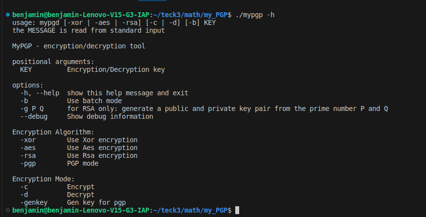
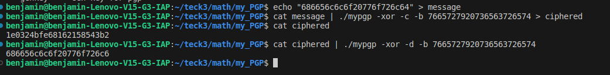
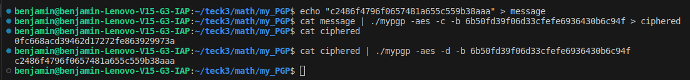
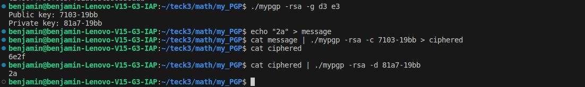
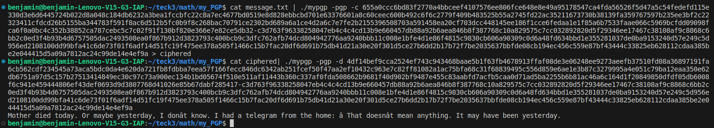
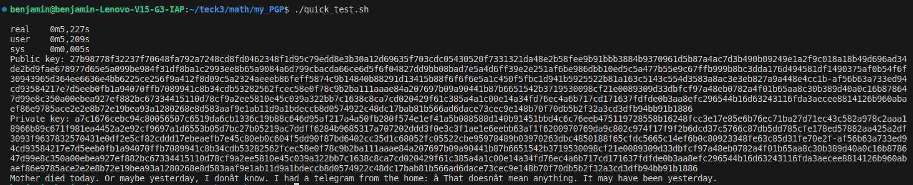

# my_PGP

This is a project for the Epitech CNA course in semester 5. The project involves implementing a simplified version of the Pretty Good Privacy (PGP) encryption system.

## Getting Started

These instructions will get you a copy of the project up and running on your local machine for development and testing purposes.

### Prerequisites

You need Python

## Exemple

### XOR

### AES

### RSA

### PGP

---

## Running the tests

./quick_test.sh

## Authors

* **Benjamin BOUREZ** - [benjamin-bourez](https://github.com/benjamin-bourez)
* **Matthieu FRAIZ** - [Mareaucanard](https://github.com/Mareaucanard)
